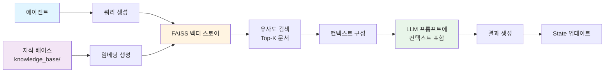
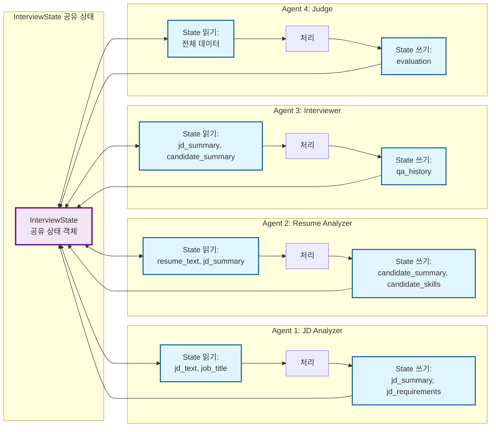

# AI Interview Agent

AI 기반 자동화 면접 시스템으로, 채용 공고(JD)와 지원자 이력서를 분석하여 맞춤형 면접 질문을 생성하고, 답변을 평가하는 멀티 에이전트 워크플로우를 제공합니다.

## 📋 목차

- [프로젝트 개요](#프로젝트-개요)
- [주요 기능](#주요-기능)
- [프로젝트 구조](#프로젝트-구조)
- [기술 스택](#기술-스택)
- [동작 원리](#동작-원리)
- [설치 및 실행](#설치-및-실행)
- [환경 변수 설정](#환경-변수-설정)
- [API 엔드포인트](#api-엔드포인트)
- [Langfuse 통합](#langfuse-통합)

## 🎯 프로젝트 개요

이 프로젝트는 **LangGraph**를 활용한 멀티 에이전트 시스템으로, 다음과 같은 면접 프로세스를 자동화합니다:

1. **JD 분석**: 채용 공고에서 요구 역량, 기술 스택, 경험 요구사항 추출
2. **이력서 분석**: 지원자의 경력, 기술, 프로젝트 경험 분석 및 JD 매칭
3. **면접 질문 생성**: JD와 이력서를 기반으로 맞춤형 면접 질문 자동 생성
4. **평가 리포트 생성**: 질문-답변을 바탕으로 종합 평가 및 추천 여부 결정

## ✨ 주요 기능

### 1. 멀티 에이전트 워크플로우
- **JD Analyzer Agent**: 채용 공고 분석 및 요구사항 추출
- **Resume Analyzer Agent**: 이력서 분석 및 JD 매칭 평가
- **Interviewer Agent**: 맞춤형 면접 질문 생성
- **Judge Agent**: 최종 평가 리포트 및 추천 생성
- **Insights Agent**: 후보자 인사이트 생성 (Soft-landing 플랜, 기여도/리스크 분석)

### 2. RAG (Retrieval Augmented Generation)
- FAISS 벡터 스토어를 활용한 지식 베이스 검색
- 포지션별(백엔드, 프론트엔드, DevOps, ML/AI 등) 면접 가이드 및 평가 기준 제공
- 각 에이전트가 RAG 컨텍스트를 활용하여 더 정확한 분석 수행

### 3. LLM 관찰성 (Observability)
- **Langfuse** 통합을 통한 모든 LLM 호출 추적
- 세션별, 에이전트별 상세 로그 및 성능 모니터링
- 대시보드에서 실시간 추적 및 분석 가능

### 4. 면접 이력 관리
- SQLite 데이터베이스를 통한 면접 결과 저장
- 이력 조회 및 재평가 기능 제공
- Streamlit UI를 통한 직관적인 인터페이스

### 5. 인터랙티브 Streamlit UI & 파일 라이브러리
- 사이드바 네비게이션(Overview / Studio / History / Insights / Settings)로 페이지 전환
- Studio 페이지에서 JD/이력서를 직접 입력하거나 **서버의 문서 라이브러리(docx/pdf/md/txt)**에서 불러오기
- **Insights 페이지**: 저장된 면접 정보를 기반으로 LLM이 생성한 Soft-landing 플랜, 기여도/리스크 차트, 성장 추천 등 후보자 인사이트 시각화

### 5. 모듈화된 UI 컴포넌트
- **컴포넌트 기반 아키텍처**: 재사용 가능한 UI 컴포넌트로 구성
  - `candidate_form.py`: 면접 실행 탭 (JD/이력서 입력, 면접 실행)
  - `history_panel.py`: 면접 이력 조회 및 상세 보기
  - `interview_chat.py`: 질문/답변 인터페이스 및 평가 결과 렌더링
  - `sidebar.py`: 설정 사이드바 (UI 모드, RAG 옵션 등)
- **유틸리티 모듈**: 공통 기능 분리
  - `state_manager.py`: Streamlit 세션 상태 관리 및 테마 CSS
  - `api_client.py`: 백엔드 API 호출 함수 모음

## 📁 프로젝트 구조

```
ai-interview-agent/
├── app/                          # Streamlit 프론트엔드
│   ├── main.py                  # 메인 Streamlit 앱 (컴포넌트 조합)
│   ├── components/              # UI 컴포넌트 모듈
│   │   ├── __init__.py
│   │   ├── overview.py         # 대시보드(Overview) 페이지
│   │   ├── candidate_form.py   # 면접 실행 (Studio) + 파일 라이브러리
│   │   ├── history_panel.py    # 면접 이력 조회/재평가
│   │   ├── interview_chat.py   # 질문/답변 트리 렌더링
│   │   ├── insights.py         # 후보자 인사이트 페이지 (Soft-landing, 기여도/리스크 차트)
│   │   ├── insights_page.py    # Insights 페이지 스텁 (레거시)
│   │   ├── settings_page.py    # 설정/플레이스홀더 화면
│   │   └── sidebar.py          # 네비게이션 & 설정 사이드바
│   ├── utils/                   # 유틸리티 모듈
│   │   ├── __init__.py         # 패키지 초기화
│   │   ├── state_manager.py    # 세션 상태 관리 및 테마 CSS
│   │   └── api_client.py       # API 호출 함수 (면접 실행, 재평가, 후속 질문 등)
│   └── images/                  # 이미지 리소스
│       ├── process.png         # 프로세스 다이어그램
│       └── sk.png              # SK 로고
│
├── server/                       # FastAPI 백엔드
│   ├── main.py                  # FastAPI 앱 진입점
│   │
│   ├── workflow/                # LangGraph 워크플로우
│   │   ├── graph.py            # 워크플로우 그래프 정의
│   │   ├── state.py            # 공유 상태(State) 정의
│   │   └── agents/             # 에이전트 구현
│   │       ├── base_agent.py  # 베이스 에이전트 클래스
│   │       ├── jd_agent.py    # JD 분석 에이전트
│   │       ├── resume_agent.py # 이력서 분석 에이전트
│   │       ├── interview_agent.py # 면접 질문 생성 에이전트
│   │       ├── judge_agent.py  # 평가 에이전트
│   │       └── insights_agent.py # 인사이트 생성 에이전트
│   │
│   ├── retrieval/               # RAG 관련 모듈
│   │   ├── loader.py           # 지식 베이스 문서 로더
│   │   ├── vector_store.py     # FAISS 벡터 스토어 관리
│   │   └── tools.py            # RAG 유틸리티
│   │
│   ├── routers/                 # FastAPI 라우터
│   │   ├── workflow.py         # 워크플로우 실행/재평가 API
│   │   ├── history.py          # 면접 이력 조회 API
│   │   └── files.py            # JD/이력서 파일 목록 & 본문 API
│   │
│   ├── db/                      # 데이터베이스
│   │   ├── database.py         # DB 연결 설정
│   │   ├── models.py           # SQLAlchemy 모델
│   │   └── schemas.py          # Pydantic 스키마
│   │
│   ├── utils/                   # 유틸리티
│   │   ├── config.py           # 설정 관리 (LLM, Langfuse 등)
│   │   └── doc_loader.py       # 문서 로딩/파싱 헬퍼 (txt/md/pdf/docx)
│   │
│   └── data/                    # 데이터 파일
│       ├── knowledge_base/      # RAG용 지식 베이스 문서
│       │   ├── backend/        # 백엔드 포지션 관련 문서
│       │   ├── frontend/       # 프론트엔드 포지션 관련 문서
│       │   ├── devops/         # DevOps 포지션 관련 문서
│       │   └── ...            # 기타 포지션별 문서
│       └── vector_store/        # FAISS 인덱스 저장 경로
│
├── docker/                      # Docker 설정
│   ├── Dockerfile.api          # 백엔드 Dockerfile
│   ├── Dockerfile.app          # 프론트엔드 Dockerfile
│   └── docker-compose.yml      # Docker Compose 설정
│
├── requirements.txt            # Python 패키지 의존성
├── README.md                   # 프로젝트 문서
└── LANGFUSE_SETUP.md          # Langfuse 설정 가이드
```

## 🛠 기술 스택

### 백엔드
- **FastAPI** (0.104.0+): 고성능 비동기 웹 프레임워크
- **LangChain** (0.3.0+): LLM 애플리케이션 개발 프레임워크
- **LangGraph** (0.2.0+): 멀티 에이전트 워크플로우 오케스트레이션
- **Langfuse** (2.0.0+): LLM 관찰성 및 추적 플랫폼
- **FAISS** (1.7.4+): 벡터 유사도 검색 라이브러리
- **SQLAlchemy** (2.0.0+): ORM 및 데이터베이스 관리
- **Pydantic** (2.0.0+): 데이터 검증 및 설정 관리

### 프론트엔드
- **Streamlit** (최신): 빠른 웹 UI 개발 프레임워크

### LLM 및 임베딩
- **Azure OpenAI**: GPT 모델 (ChatGPT-4, GPT-3.5-turbo 등)
- **Azure OpenAI Embeddings**: 텍스트 임베딩 생성

### 데이터베이스
- **SQLite**: 경량 관계형 데이터베이스 (면접 이력 저장)

## 🔄 동작 원리

### 1. LangGraph 워크플로우 시각화

다음은 AI Interview Agent의 LangGraph 워크플로우 다이어그램입니다:

#### 1.1 전체 워크플로우 개요


#### 1.2 상세 Agent 워크플로우 (LangGraph 스타일)

각 Agent의 내부 동작을 상세히 보여주는 다이어그램입니다:

```mermaid
graph TD
    subgraph "AI Interview Agent Workflow using LangGraph"
        Start([시작:<br/>JD + 이력서 입력]) --> JD_Node[JD Analyzer Node]
        
        JD_Node --> JD_RAG[Vectorstore Retrieve<br/>포지션별 가이드 검색]
        JD_RAG --> JD_LLM[Create JD Analysis LLM]
        JD_LLM --> JD_State[Update State:<br/>jd_summary<br/>jd_requirements]
        JD_State --> Resume_Node[Resume Analyzer Node]
        
        Resume_Node --> Resume_RAG[Vectorstore Retrieve<br/>평가 기준 검색]
        Resume_RAG --> Resume_LLM[Create Resume Analysis LLM]
        Resume_LLM --> Resume_State[Update State:<br/>candidate_summary<br/>candidate_skills]
        Resume_State --> Interview_Node[Interviewer Node]
        
        Interview_Node --> Interview_RAG[Vectorstore Retrieve<br/>면접 질문 예시 검색]
        Interview_RAG --> Interview_LLM[Create Questions LLM]
        Interview_LLM --> Interview_State[Update State:<br/>qa_history]
        Interview_State --> Judge_Node[Judge Node]
        
        Judge_Node --> Judge_RAG[Vectorstore Retrieve<br/>평가 기준 검색]
        Judge_RAG --> Judge_LLM[Create Evaluation LLM]
        Judge_LLM --> Judge_State[Update State:<br/>evaluation]
        Judge_State --> End([종료:<br/>최종 평가 결과])
        
        style JD_Node fill:#e1f5ff,stroke:#01579b,stroke-width:2px
        style Resume_Node fill:#e1f5ff,stroke:#01579b,stroke-width:2px
        style Interview_Node fill:#e1f5ff,stroke:#01579b,stroke-width:2px
        style Judge_Node fill:#e1f5ff,stroke:#01579b,stroke-width:2px
        
        style JD_RAG fill:#fff4e1,stroke:#e65100,stroke-width:2px
        style Resume_RAG fill:#fff4e1,stroke:#e65100,stroke-width:2px
        style Interview_RAG fill:#fff4e1,stroke:#e65100,stroke-width:2px
        style Judge_RAG fill:#fff4e1,stroke:#e65100,stroke-width:2px
        
        style JD_LLM fill:#e8f5e9,stroke:#2e7d32,stroke-width:2px
        style Resume_LLM fill:#e8f5e9,stroke:#2e7d32,stroke-width:2px
        style Interview_LLM fill:#e8f5e9,stroke:#2e7d32,stroke-width:2px
        style Judge_LLM fill:#e8f5e9,stroke:#2e7d32,stroke-width:2px
        
        style JD_State fill:#f3e5f5,stroke:#6a1b9a,stroke-width:2px
        style Resume_State fill:#f3e5f5,stroke:#6a1b9a,stroke-width:2px
        style Interview_State fill:#f3e5f5,stroke:#6a1b9a,stroke-width:2px
        style Judge_State fill:#f3e5f5,stroke:#6a1b9a,stroke-width:2px
        
        style Start fill:#c8e6c9,stroke:#1b5e20,stroke-width:3px
        style End fill:#ffcdd2,stroke:#b71c1c,stroke-width:3px
    end
```



#### 1.3 RAG 통합 상세 흐름

각 Agent 내부의 RAG 검색 과정을 상세히 보여주는 다이어그램입니다:

```mermaid
graph TD
    subgraph "Agent 내부 RAG 프로세스"
        Agent[Agent 실행] --> Query[쿼리 생성<br/>예: 포지션별 가이드]
        Query --> FAISS[FAISS Vectorstore<br/>유사도 검색 Top-K]
        FAISS --> Docs[관련 문서 검색<br/>knowledge_base/]
        Docs --> Context[컨텍스트 구성<br/>문서 내용 결합]
        Context --> Prompt[LLM 프롬프트 생성<br/>System + User + Context]
        Prompt --> LLM[LLM 호출<br/>Azure OpenAI]
        LLM --> Parse[결과 파싱<br/>구조화된 데이터 추출]
        Parse --> Update[State 업데이트<br/>InterviewState]
        Update --> Next[다음 Agent로 전달]
    end
    
    style Agent fill:#e1f5ff,stroke:#01579b,stroke-width:2px
    style FAISS fill:#fff4e1,stroke:#e65100,stroke-width:2px
    style LLM fill:#e8f5e9,stroke:#2e7d32,stroke-width:2px
    style Update fill:#f3e5f5,stroke:#6a1b9a,stroke-width:2px
```



### 2. 워크플로우 상세 설명

#### 2.1 JD Analyzer Agent
- **입력**: JD 텍스트, Job Title
- **RAG 검색**: 포지션별 채용 가이드 및 요구 역량 문서
- **LLM 처리**: JD 분석 및 요구사항 추출
- **출력**: `jd_summary`, `jd_requirements` (State에 저장)

#### 2.2 Resume Analyzer Agent
- **입력**: 이력서 텍스트, JD 분석 결과
- **RAG 검색**: 이력서 평가 기준 및 인터뷰 팁 문서
- **LLM 처리**: 이력서 분석 및 JD 매칭 평가
- **출력**: `candidate_summary`, `candidate_skills` (State에 저장)

#### 2.3 Interviewer Agent
- **입력**: JD 분석 결과, 이력서 분석 결과
- **RAG 검색**: 면접 질문 예시 및 평가 기준 문서
- **LLM 처리**: 맞춤형 면접 질문 리스트 생성
- **출력**: `qa_history` (질문 리스트, State에 저장)

#### 2.4 Judge Agent
- **입력**: 전체 면접 데이터 (JD, 이력서, 질문-답변)
- **RAG 검색**: 채용 평가 기준 및 역량 정의 문서
- **LLM 처리**: 최종 평가 리포트 생성
- **출력**: `evaluation` (강점/약점/점수/추천, State에 저장)

### 3. RAG 통합 워크플로우

각 에이전트는 RAG(Retrieval Augmented Generation)를 통해 지식 베이스를 활용합니다:



### 4. 상태 관리 (State Management)

**LangGraph**는 `InterviewState`라는 공유 상태 객체를 통해 모든 에이전트 간 데이터를 공유합니다:

#### 4.1 State 공유 흐름도



#### 4.2 State 구조

```python
class InterviewState(TypedDict):
    # 기본 정보
    job_title: str
    candidate_name: str
    jd_text: str
    resume_text: str
    
    # 분석 결과
    jd_summary: str
    jd_requirements: List[str]
    candidate_summary: str
    candidate_skills: List[str]
    
    # 면접 진행 상태
    qa_history: List[QATurn]
    total_questions: int
    status: InterviewStatus
    
    # RAG 컨텍스트
    rag_contexts: Dict[str, str]
    rag_docs: Dict[str, List[Any]]
    
    # 최종 평가 결과
    evaluation: Optional[EvaluationResult]
```

각 에이전트는 이 상태를 읽고 업데이트하면서 순차적으로 작업을 수행합니다.

### 5. RAG (Retrieval Augmented Generation)

각 에이전트는 필요에 따라 FAISS 벡터 스토어에서 유사한 문서를 검색하여 컨텍스트로 활용합니다:

1. **문서 로딩**: `server/data/knowledge_base/` 디렉토리에서 `.txt`, `.md` 파일 로드
2. **청크 분할**: `RecursiveCharacterTextSplitter`로 문서를 800자 단위로 분할
3. **임베딩 생성**: Azure OpenAI Embeddings로 벡터화
4. **FAISS 인덱싱**: 벡터를 FAISS 인덱스로 저장
5. **유사도 검색**: 쿼리와 유사한 상위 k개 문서 검색

### 6. Langfuse 통합

모든 LLM 호출은 **Langfuse CallbackHandler**를 통해 자동으로 추적됩니다:

- 각 에이전트의 LLM 호출이 세션별로 그룹화되어 추적
- LangGraph의 `thread_id`를 통해 워크플로우 전체를 하나의 세션으로 관리
- Langfuse 대시보드에서 실시간으로 추적 및 분석 가능

## 🚀 설치 및 실행

### 1. 저장소 클론

```bash
git clone <repository-url>
cd ai-interview-agent
```

### 2. 의존성 설치

```bash
pip install -r requirements.txt
```

### 3. 환경 변수 설정

`server/.env` 파일을 생성하고 필요한 환경 변수를 설정합니다 (자세한 내용은 [환경 변수 설정](#환경-변수-설정) 참조).

### 4. 백엔드 서버 실행

```bash
cd server
uvicorn main:app --reload --port 9898
```

백엔드 API는 `http://localhost:9898`에서 실행됩니다.

### 5. 프론트엔드 실행

새 터미널에서:

```bash
cd app
streamlit run main.py
```

Streamlit 앱은 기본적으로 `http://localhost:8501`에서 실행됩니다.

## ⚙️ 환경 변수 설정

### `server/.env` 파일 예시

```env
# 프로젝트 설정
PROJECT_NAME=AI Interview Agent
DB_PATH=interview_history.db

# Azure OpenAI 설정
AZURE_OPENAI_API_KEY=your-azure-openai-api-key
AZURE_OPENAI_ENDPOINT=https://your-resource.openai.azure.com/
AZURE_OPENAI_API_VERSION=2024-02-15-preview
AZURE_OPENAI_DEPLOYMENT_NAME=gpt-4
AZURE_OPENAI_EMBEDDING_DEPLOYMENT_NAME=text-embedding-ada-002

# Langfuse 설정 (선택사항)
LANGFUSE_ENABLED=true  # Langfuse 활성화 여부 (true/false, 기본값: true)
LANGFUSE_PUBLIC_KEY=pk-lf-...
LANGFUSE_SECRET_KEY=sk-lf-...
LANGFUSE_HOST=https://cloud.langfuse.com

# CORS 설정
BACKEND_CORS_ORIGINS=["http://localhost:8501","http://localhost:3000"]
```

### `app/.env` 파일 예시

```env
API_BASE_URL=http://localhost:9898/api/v1
```

## 📡 API 엔드포인트

### 1. 면접 워크플로우 실행

**POST** `/api/v1/workflow/interview/run`

면접 워크플로우를 실행하고 결과를 반환합니다.

**Request Body:**
```json
{
  "job_title": "백엔드 개발자",
  "candidate_name": "홍길동",
  "jd_text": "채용 공고 내용...",
  "resume_text": "이력서 내용...",
  "total_questions": 5,
  "enable_rag": true,
  "use_mini": false,
  "save_history": true
}
```

**Response:**
```json
{
  "status": "DONE",
  "state": {
    "job_title": "백엔드 개발자",
    "jd_summary": "...",
    "qa_history": [...],
    "evaluation": {...}
  },
  "interview_id": 1
}
```

### 2. 면접 이력 조회

**GET** `/api/v1/interviews/?limit=20`

면접 이력 목록을 조회합니다.

### 3. 면접 상세 조회

**GET** `/api/v1/interviews/{interview_id}`

특정 면접의 상세 정보를 조회합니다.

### 4. 재평가 실행

**POST** `/api/v1/workflow/interview/rejudge`

수정된 질문-답변을 기반으로 Judge Agent만 재실행합니다.

**Request Body:**
```json
{
  "interview_id": 1,
  "qa_history": [
    {
      "question": "질문 내용",
      "answer": "답변 내용",
      "category": "기술"
    }
  ],
  "enable_rag": true,
  "use_mini": false
}
```

### 5. 인사이트 생성

**POST** `/api/v1/workflow/interview/insights`

저장된 면접 결과를 기반으로 후보자 인사이트를 생성합니다. Soft-landing 플랜, 기여도/리스크 스코어, 성장 추천 등을 포함합니다.

**Request Body:**
```json
{
  "interview_id": 1,
  "use_mini": true
}
```

**Response:**
```json
{
  "status": "success",
  "interview_id": 1,
  "insights": {
    "soft_landing_plan": "입사 후 90일 온보딩 플랜...",
    "contribution_summary": "기여도 요약...",
    "contribution_scores": {
      "short_term_impact": 4.2,
      "long_term_growth": 4.5,
      "team_fit": 4.0,
      "risk_level": 2.5
    },
    "risk_factors": ["리스크 요소 1", "리스크 요소 2"],
    "growth_recommendations": ["성장 추천 1", "성장 추천 2"]
  }
}
```

## 🔍 Langfuse 통합

Langfuse를 통한 LLM 추적 및 관찰성을 활용하려면:

1. **Langfuse 계정 생성**: https://cloud.langfuse.com 에서 계정 생성
2. **API 키 발급**: Public Key와 Secret Key 발급
3. **환경 변수 설정**: `server/.env`에 Langfuse 설정 추가
4. **대시보드 확인**: Langfuse 대시보드에서 세션별 추적 데이터 확인

### Langfuse 활성/비활성 설정

개발 중 비용 절감을 위해 Langfuse 전송을 비활성화할 수 있습니다:

```env
# Langfuse 비활성화 (개발 중 비용 절감)
LANGFUSE_ENABLED=false
```

- `LANGFUSE_ENABLED=true` (기본값): Langfuse 추적 활성화
- `LANGFUSE_ENABLED=false`: Langfuse 추적 비활성화 (데이터 전송 안 함)

**참고**: `LANGFUSE_ENABLED=false`로 설정하면 Langfuse로 데이터가 전송되지 않으므로, 개발 중 비용을 절감할 수 있습니다.

자세한 설정 방법은 [LANGFUSE_SETUP.md](./LANGFUSE_SETUP.md)를 참조하세요.

### Langfuse에서 확인 가능한 정보

- **Traces**: 모든 LLM 호출의 상세 로그
- **Sessions**: 세션별로 그룹화된 워크플로우 실행 기록
- **Latency**: 각 에이전트의 실행 시간
- **Token Usage**: LLM 호출별 토큰 사용량
- **Cost**: 비용 추적

## 📝 사용 예시

### Streamlit UI 사용

1. 브라우저에서 `http://localhost:8501` 접속
2. 채용 공고(JD)와 지원자 이력서 입력
3. "AI 면접 에이전트 실행" 버튼 클릭
4. 생성된 면접 질문 확인 및 답변 입력
5. 최종 평가 결과 확인

### API 직접 호출

```python
import requests

url = "http://localhost:9898/api/v1/workflow/interview/run"
payload = {
    "job_title": "백엔드 개발자",
    "candidate_name": "홍길동",
    "jd_text": "채용 공고 내용...",
    "resume_text": "이력서 내용...",
    "total_questions": 5,
    "enable_rag": True,
    "use_mini": False,
    "save_history": True
}

response = requests.post(url, json=payload)
result = response.json()
print(result["state"]["evaluation"])
```

## 🧪 테스트

### LangGraph 워크플로우 시각화

워크플로우 그래프를 시각화하여 구조를 확인할 수 있습니다:

```bash
cd server
python workflow/visualize_graph.py
```

이 스크립트는 다음을 제공합니다:
- **ASCII 아트**: 콘솔에 텍스트 기반 다이어그램 출력
- **Mermaid 코드**: Mermaid 다이어그램 코드 생성 (https://mermaid.live/ 에서 시각화 가능)
- **그래프 정보**: 노드 및 엣지 목록 출력

### Langfuse 연결 테스트

```bash
cd server
python3 test_langfuse.py
```

## 📚 추가 문서

- [LANGFUSE_SETUP.md](./LANGFUSE_SETUP.md): Langfuse 설정 및 사용 가이드

## 🤝 기여

이슈 리포트 및 풀 리퀘스트를 환영합니다.

## 📄 라이선스

[라이선스 정보를 여기에 추가하세요]

---

**개발자**: AI Interview Agent Team  
**버전**: 0.2.0

## 📦 컴포넌트 구조 상세

### 프론트엔드 아키텍처

프론트엔드는 모듈화된 컴포넌트 구조로 설계되어 유지보수성과 재사용성을 높였습니다:

```
app/
├── main.py                    # 앱 진입점, 네비게이션 조합
├── components/
│   ├── sidebar.py            # 사이드바 (메뉴 + 설정)
│   ├── overview.py           # Overview(대시보드) 페이지
│   ├── candidate_form.py     # Studio 페이지 + 파일 라이브러리
│   ├── interview_chat.py      # 질문/답변 및 평가 렌더링
│   ├── history_panel.py      # 면접 이력 조회/재평가
│   ├── insights.py           # Insights 페이지 (Soft-landing, 차트)
│   └── settings_page.py      # 향후 확장용 설정 페이지
└── utils/
    ├── state_manager.py       # 세션 상태 관리, 테마 CSS
    └── api_client.py          # 백엔드 API 호출
```

### 컴포넌트 역할

- **`main.py`**: Streamlit 앱의 진입점으로, 페이지 설정 및 컴포넌트 조합을 담당
- **`components/sidebar.py`**: 네비게이션/설정 UI, RAG 옵션, 질문 개수 등 제어
- **`components/overview.py`**: 대시보드 소개 및 빠른 액션(Studio/History 이동)
- **`components/candidate_form.py`**: Studio 화면, JD/이력서 텍스트 입력 + 파일 라이브러리, 면접 실행
- **`components/interview_chat.py`**: 질문/답변 트리 구조 렌더링, 평가 결과 표시
- **`components/history_panel.py`**: 면접 이력 목록 조회, 상세/재평가 UI
- **`components/insights.py`**: 후보자 인사이트 페이지 구현 (Soft-landing 플랜, 기여도/리스크 차트, 성장 추천 등)
- **`components/settings_page.py`**: 시스템 설정/추후 확장용 플레이스홀더
- **`utils/state_manager.py`**: Streamlit 세션 상태 초기화 및 테마 CSS 적용
- **`utils/api_client.py`**: 백엔드 API 호출 함수 (면접 실행, 재평가, 후속 질문 등)
